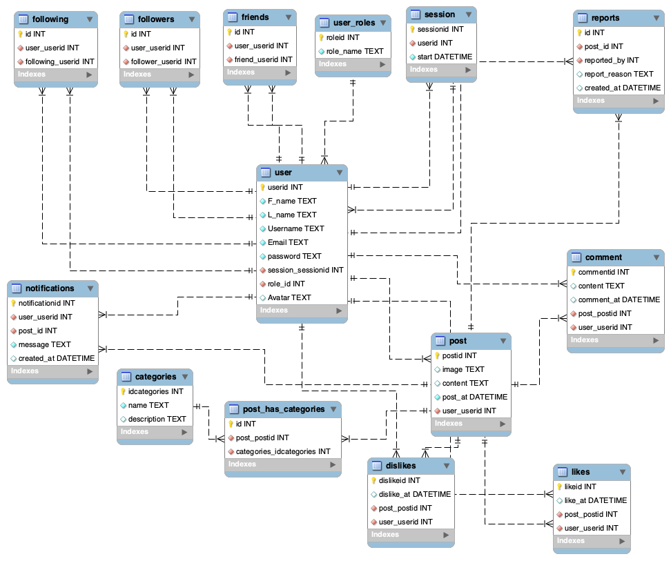

# Forum

This project is a web-based forum application that allows users to create, view, and manage posts. It includes features such as user authentication, image uploads, moderation tools, and more.

## Features

- User authentication and authorization
- Post creation and management
- Image uploads
- Moderation tools
- Security features
- Advanced forum functionalities
- User profiles
- Notifications

## Objectives

The web forum is designed to facilitate:

- Communication between users.
- Associating categories with posts.
- Liking and disliking posts and comments.
- Filtering posts.

## SQLite

SQLite is utilized to store data in the forum, including users, posts, comments, etc. As an embedded database software, SQLite is widely used for local/client storage in application software such as web browsers. It enables the creation and control of a database using queries.

An entity relationship diagram has been created to structure the database and achieve better performance. The implementation includes at least one SELECT, one CREATE, and one INSERT query.

## Authentication

The forum allows users to register by inputting their credentials. A login session is created to access the forum and add posts and comments. Cookies are used to ensure each user has only one open session, with each session containing an expiration date.

### User Registration Instructions

- Email is required.
  - If the email is already taken, an error response is returned.
- Username is required.
- Password is required.
  - The password is encrypted when stored (bonus task).

The forum verifies if the provided email is present in the database and if all credentials are correct. If the password does not match, an error response is returned.

## Communication

Users can communicate by creating posts and comments.

- Only registered users can create posts and comments.
- Registered users can associate one or more categories with their posts.
  - The implementation and choice of categories are flexible.
- Posts and comments are visible to all users (registered or not).
  - Non-registered users can only view posts and comments.

## Likes and Dislikes

Only registered users can like or dislike posts and comments.

- The number of likes and dislikes is visible to all users (registered or not).

## Filter

A filter mechanism is implemented to allow users to filter displayed posts by:

- Categories
- Created posts
- Liked and disliked posts
- Created comments

Filtering by categories functions as subforums, which are sections of an online forum dedicated to specific topics. Filtering by created and liked posts is only available for registered users and refers to the logged-in user.

## Advanced Features

- Advanced like, dislike and comments
- Moderation
- Security
- Image Upload
- Social Authentication

## Docker

Docker is used for the forum project. The Docker image and container can be built using the following command:

```sh
docker-compose up --build
```

## Instructions

- SQLite is used.
- Website errors and HTTP status are handled.
- All sorts of technical errors are managed.
- The code adheres to good practices.
- Test files for unit testing are included.

## Getting Started

### Database Entity Relationship Diagram (ERD)



### Project Structure

```
Forum/
├── .dockerignore
├── .gitignore
├── compose.yaml
├── database/
│   ├── database.go
│   └── Sqlstat.go
├── dockerfile
├── erd/
│   ├── Forum.mwb
│   └── ForumDB.sql
├── go.mod
├── go.sum
├── LICENSE.md
├── main.go
├── README.md
├── run.sh
├── src/
│   ├── advanced-features/
│   ├── authentication/
│   ├── image-upload/
│   ├── moderation/
│   ├── security/
│   └── server/
├── static/
│   ├── assets/
│   ├── css/
│   ├── js/
│   └── uploads/
└── templates/
    ├── admin.html
    ├── changepassword.html
    ├── error.html
    ├── home.html
    ├── index.html
    ├── login.html
    ├── moderator.html
    ├── myprofile.html
    ├── newpost.html
    ├── notifications.html
    └── post.html
```

### Prerequisites

- Docker
- Go (Golang)
- MySQL

### Installation

1. Clone the repository:

    ```sh
    git clone https://github.com/yourusername/forum.git
    cd forum
    ```

2. Build and run the Docker containers:

    ```sh
    docker-compose up --build
    ```

3. Access the application at `http://localhost:8080`.

## Example Usage

1. Register a new user.
2. Log in with the registered user.
3. Create a new post.
4. View and interact with posts.

## Example Images

Here are some example images of the site:


## Limitations

- Limited to basic forum functionalities.
- No real-time updates.

## Future Improvements

- Add real-time notifications.
- Improve the user interface.
- Implement more advanced moderation tools.
- Enhance security features.
- Add support for multiple languages.

## Contributing

1. Fork the repository.
2. Create your feature branch (`git checkout -b feature/NewFeature`).
3. Commit your changes (`git commit -m 'Add NewFeature'`).
4. Push to the branch (`git push origin feature/NewFeature`).
5. Open a Pull Request.

## Authors

- Sayed Ahmed Husain
- Qasim Aljaffer
- Mohammed AlAlawi
- Abdulla Alasmawi

## License

This project is licensed under the MIT License. See the [LICENSE.md](https://github.com/sahmedhusain/forum?tab=MIT-1-ov-file) file for details.
