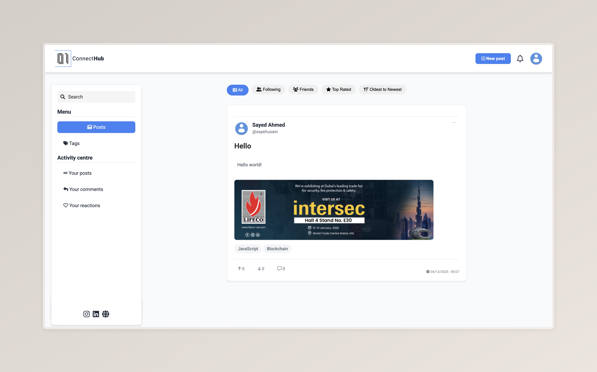
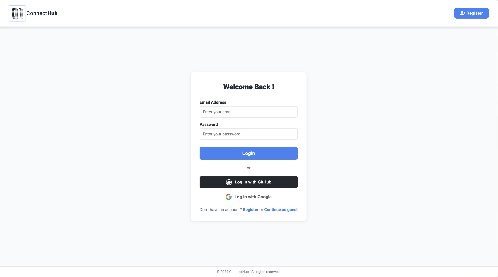
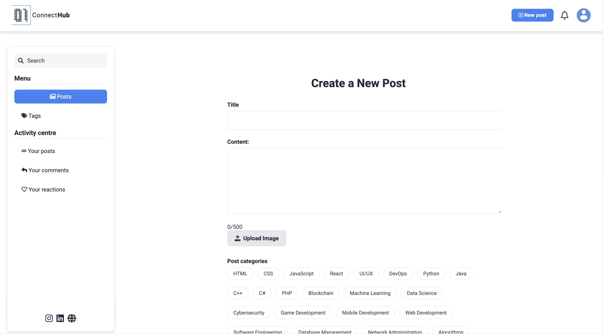
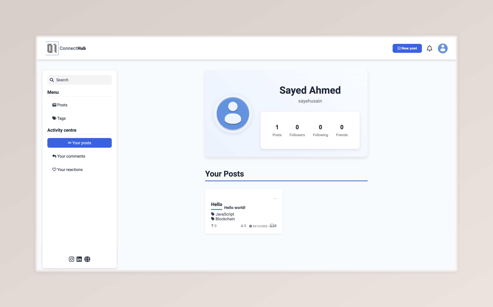
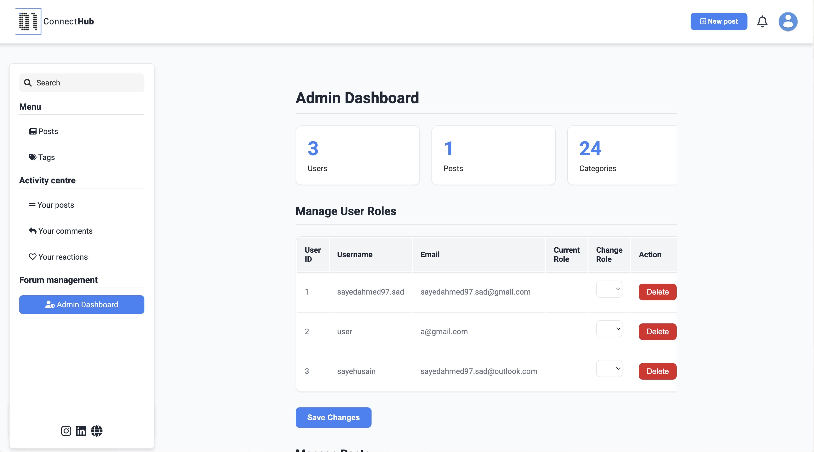
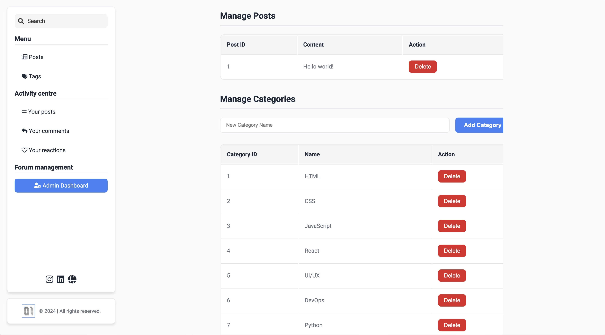
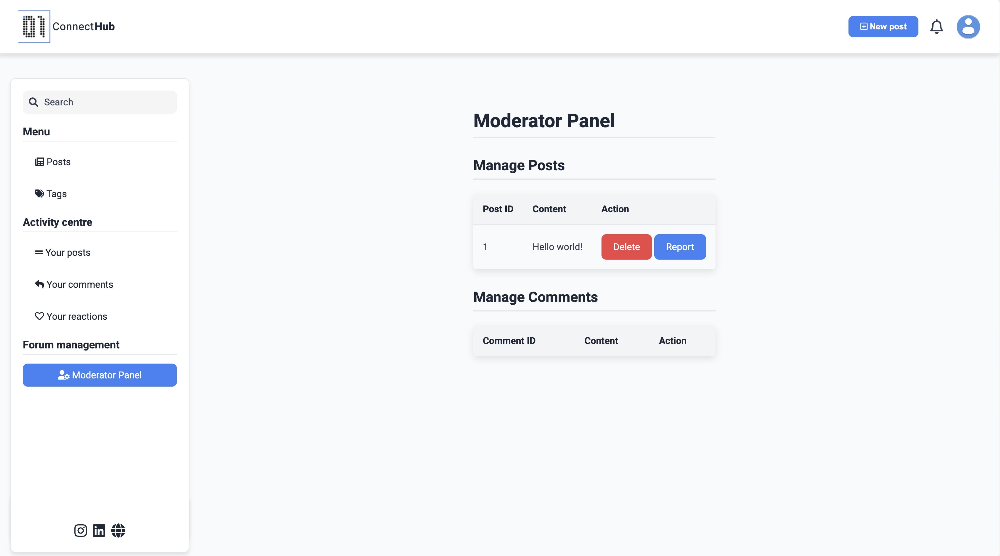

# 01 ConnectHub 🌐

[](https://golang.org/)
[](LICENSE.md)
[](https://html.spec.whatwg.org/)
[](https://www.w3.org/Style/CSS/)
[](https://www.ecma-international.org/publications-and-standards/standards/ecma-262/)
[](https://www.sqlite.org/)
[](https://www.docker.com/)
[](https://oauth.net/2/)

Welcome to **01 ConnectHub**, a web-based forum application built with Go. This platform lets users create accounts, share posts, leave comments, and interact with each other in a safe and organized way. Whether you want to discuss topics, share ideas, or build a community, 01 ConnectHub makes it easy and fun.

## ✨ Features

Here are the main features that make 01 ConnectHub special:

- **User Registration and Login** 🔐: Users can sign up with an email, username, and password. Passwords are securely encrypted using bcrypt hashing to protect against breaches. Sessions are managed with cookies that expire, ensuring users stay logged in safely. Social login via Google or GitHub is also available using OAuth2, making it easy to join without creating a new password.
- **Creating and Managing Posts** 📝: Logged-in users can write posts with titles, content, and categories. Posts can be edited or deleted by the author. Categories help organize content, like "General Discussion" or "Tech Talk".
- **Comments on Posts** 💬: Add comments to posts to start discussions. Comments are threaded, so replies are easy to follow. Users can comment on posts to share opinions or ask questions.
- **Liking and Disliking** 👍👎: Show what you think by liking or disliking posts and comments. The total likes and dislikes are visible to everyone, helping highlight popular content.
- **Image Uploads** 🖼️: Attach images to your posts to make them more visual and engaging. Images are uploaded securely using Go's multipart form handling, stored in the server's file system, and served efficiently. Supported formats include common image types like JPEG and PNG, with size limits to prevent abuse.
- **Moderation Tools** 🛡️: Admins and moderators have special powers to manage the forum. They can delete inappropriate posts or comments, ban users, and report content. Moderation helps keep the community safe and respectful. Roles are assigned based on user permissions in the database.
- **Filtering Posts** 🔍: Find posts easily by category, your own posts, liked posts, or posts you've commented on. This helps you discover relevant content quickly without scrolling through everything.
- **Notifications** 🔔: Get notified about new comments on your posts or other interactions. Notifications appear on the user's profile page.
- **Security Measures** 🔒: The site protects against common web threats like CSRF attacks using tokens, input validation to prevent SQL injection, and secure password handling.
- **Social Login** 🌍: Quick login with Google or GitHub without needing a separate password, using OAuth2 protocol for secure authentication.

These features work together to create a complete forum experience.

## 🛠️ Technologies Used

01 ConnectHub is built using these tools and languages:

- **Go** 🐹: The main programming language for the server, handling requests, and running the application. Uses goroutines for concurrent user handling.
- **HTML** 🌐: For creating the structure of web pages, like forms and layouts.
- **CSS** 🎨: For styling the pages to look good and work on different devices.
- **JavaScript** ⚡: For adding interactive elements, like menus that drop down.
- **SQLite** 🗄️: A simple database to store all the user data, posts, and comments.
- **Docker** 🐳: For packaging the app so it runs the same way everywhere.
- **Gorilla Sessions** 🍪: A Go library for managing user sessions securely with cookies.
- **OAuth2** 🔑: Protocol for secure social logins with Google and GitHub.
- **UUID** 🆔: For generating unique identifiers for sessions and users.
- **Bcrypt** 🔐: For hashing passwords securely during authentication.
- **Multipart Forms** 📎: Go's built-in support for handling file uploads, used for image uploads.

These technologies ensure the app is secure, fast, and user-friendly.

## 🎯 What We Aim For

Our goal with 01 ConnectHub is to provide a simple yet powerful forum where people can connect and share ideas. The app handles user accounts, posts, comments, and interactions smoothly.

The forum works with these key parts:

1. **Users** 👤: People who register and log in to use the site.
2. **Posts** 📄: Main content shared by users, grouped by categories.
3. **Comments** 💬: Responses to posts for discussions.
4. **Interactions** 👍: Likes and dislikes to show agreement or disagreement.

We use a database to keep everything organized.

### Database Schema Details

The database is set up like this to store information:

- **Users Table**: Holds user details like email, username, and encrypted password.
- **Posts Table**: Stores post info, linked to the user who made it and a category.
- **Comments Table**: Keeps comments, connected to posts and users.
- **Categories Table**: Lists categories for organizing posts.
- **Likes Table**: Records likes and dislikes from users.

Here's a simple view:

```
Users: id, email, username, password_hash, created_at
Posts: id, user_id, title, content, category_id, created_at
Comments: id, post_id, user_id, content, created_at
Categories: id, name
Likes: id, user_id, post_id/comment_id, type (like/dislike)
```

| Table      | Key Fields           | What It Stores                      |
| ---------- | -------------------- | ----------------------------------- |
| Users      | id, email, username  | User accounts and login info        |
| Posts      | id, user_id, title   | Forum posts with text and images    |
| Comments   | id, post_id, content | Comments under posts                |
| Categories | id, name             | Groups for posts                    |
| Likes      | user_id, post_id     | User opinions on posts and comments |

### User Flow Representation

Users move through the site like this:

```
Registration/Login ---- Create Post ---- Add Comment ---- Like/Dislike
```

- **Steps**: Start by signing up, then post, comment, and interact.
- **Connections**: Each action leads to the next, building discussions.

This flow makes the site easy to use.

## 🚀 Getting Started

### Prerequisites

- Go 1.23.2 or higher installed on your machine.
- Docker and Docker Compose (optional).

### Installation

1. Clone the repo:
   ```bash
   git clone https://github.com/sahmedhusain/01connecthub.git
   ```
2. Go to the project folder:
   ```bash
   cd 01connecthub
   ```
3. Install dependencies:
   ```bash
   go mod tidy
   ```
4. Build the application:
   ```bash
   go build -o 01connecthub
   ```
5. Run the server:
   ```bash
   ./01connecthub
   ```

## 📖 How to Use

Once the server is running, here's how to use 01 ConnectHub:

1. **Sign Up or Log In**: Create an account with your email and password, or use Google/GitHub.
2. **Make a Post**: Click to create a new post, add a title, content, category, and maybe an image.
3. **Comment**: On any post, add your thoughts in the comments section.
4. **Interact**: Like or dislike posts and comments to share your views.
5. **Filter**: Use the filter options to see posts by category or your activity.
6. **Moderate**: If you're an admin, manage users and content from the admin page.

The site guides you through each step.

### Database Operations

Behind the scenes, the app does these database tasks:

- **Create**: Add new posts, comments, or users.
- **Read**: Fetch posts to display.
- **Update**: Change post content or user info.
- **Delete**: Remove posts or comments.

## 🧠 Application Logic Explanation

ConnectHub uses web development patterns to handle requests. The main steps are:

1. **Handle Requests**: Parse HTTP requests with Go handlers.
2. **Authenticate Users**: Validate sessions and credentials.
3. **Process Data**: Query database for posts, comments.
4. **Render Pages**: Use HTML templates to display content.
5. **Manage Security**: Implement CSRF and secure cookies.

### Database ERD


_The ERD shows relationships between User, Post, Comment, Category, and Like entities, including their attributes._

### Authentication Logic

For login:

- You enter your details on the login page.
- The app hashes your password with bcrypt and compares it to the stored hash in the database.
- If correct, a session is created using Gorilla Sessions, storing a unique UUID in a secure cookie.
- For social login, OAuth2 redirects to Google/GitHub, which returns user info to create or log in the user.
- Sessions expire after a set time for security.

### Image Upload Logic

Uploading images:

- Users select a file on the post creation page.
- The form uses multipart encoding to send the file.
- Go's http package parses the multipart form, validates the file type and size.
- The image is saved to the server's static/uploads folder with a unique name.
- The file path is stored in the database linked to the post.
- Images are served via the /static/ route.

### Moderation Logic

Moderating the forum:

- Admins have a special role checked in the database.
- From the admin page, they can view all users and posts.
- Deleting a post or comment removes it from the database and updates related counts.
- Banning a user sets a flag in their profile, preventing login.
- Reports are handled by admins reviewing flagged content.

### Content Management

Managing posts and comments:

| Action      | What Happens          | Example SQL                      |
| ----------- | --------------------- | -------------------------------- |
| Add Post    | Save to database      | INSERT INTO posts VALUES (...)   |
| Show Posts  | Get from database     | SELECT \* FROM posts             |
| Add Comment | Link to post and save | INSERT INTO comments VALUES(...) |

This keeps everything organized.

### Interaction Simulation

When you like something:

- The like count goes up.
- The page updates to show the change.

## Terminal Examples 💻

### Building the Project 🏗️

```bash
$ go build -o 01connecthub
$ ls -la 01connecthub
-rwxr-xr-x  1 user  group  12345678 Dec 24 12:00 01connecthub
```

### Running the Server 🚀

```bash
$ ./01connecthub
Server running on http://localhost:8080
To stop the server press Ctrl+C
```

### Using Docker 🐳

```bash
$ docker-compose up --build
Building 01connecthub
...
01connecthub_1  | Server running on http://localhost:8080
```

## Screenshots 📸









## 🛠️ Under the Hood

### Data Handling

The app turns user inputs into database entries:

- **User Data**: Email, name, password.
- **Post Data**: Title, text, category.
- **Comment Data**: Text linked to posts.

It checks inputs to prevent errors.

### Code Structure

The code is organized like this:

- **main.go**: Starts the server.
- **database/**: Connects to and queries the database.
- **src/server/**: Handles web requests.
- **src/authentication/**: Manages logins.
- **templates/**: HTML pages.
- **static/**: Styles and scripts.

### Error Management

If something goes wrong, like wrong login or missing data, the app shows a clear message and stops. Common issues include invalid emails or database problems.

The app runs efficiently for many users at once.

## 🤝 Contributing

We'd love your help! Fork the repo, make changes, and send a pull request. Please follow Go standards and add tests where possible.

## 📄 License

Licensed under MIT - check [LICENSE.md](LICENSE.md) for more.

## 🙏 Acknowledgments

This project was created during a Go web development learning journey, emphasizing full-stack implementation and community building. Inspired by modern forum platforms.

## 👥 Authors

- **Sayed Ahmed Husain** - [sayedahmed97.sad@gmail.com](mailto:sayedahmed97.sad@gmail.com)
- **Qasim Aljaffer**
- **Mohammed AlAlawi**
- **Abdulla Alasmawi**

## 📚 What I Learned

Building this taught me:

- Web application development with Go.
- Database design and SQL queries.
- User authentication and security.
- Frontend integration with HTML/CSS/JS.
- Containerization with Docker.

## Limitations 🚫

- No real-time updates (requires page refresh).
- Limited scalability for very large user bases.
- Basic moderation features.
- No advanced search functionality.

## Future Improvements 🔮

- Add real-time notifications with WebSockets.
- Implement advanced search and filtering.
- Enhance moderation with AI content detection.
- Add user roles and permissions.
- Integrate more social authentication providers.
